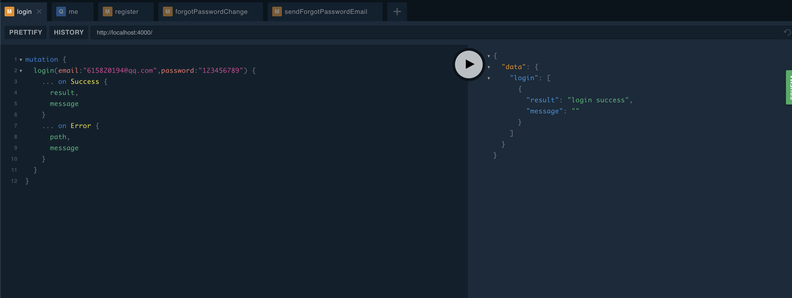
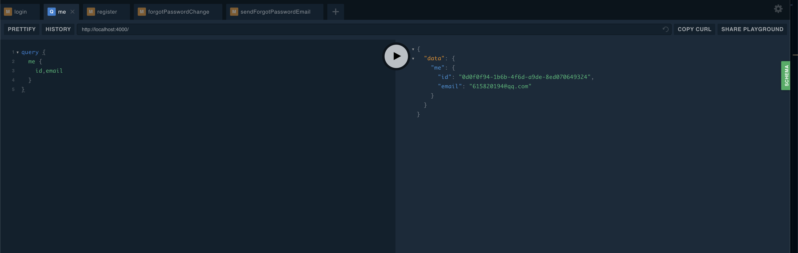

# graphql-ts-server-boilerplate

A GraphQL Server boilerplate made with Typescript, PostgreSQL, and Redis

## Installation

1. Clone project
```
git clone https://github.com/Septemus/graphql-typeorm-ts-server.git
```
2. cd into folder
```
cd graphql-typeorm-ts-server
```
3. Download dependencies 
```
yarn
```
4. Start PostgreSQL server
5. Create database called `graphql-typeorm-ts-server`
```
createdb graphql-typeorm-ts-server
```
1. [Add a user](https://medium.com/coding-blocks/creating-user-database-and-adding-access-on-postgresql-8bfcd2f4a91e) with the username `postgres` and password `postgres`. (You can change what these values are in the [ormconfig.json](https://github.com/Septemus/graphql-typeorm-ts-server/blob/master/ormconfig.json))

2. Install and start Redis

## Usage

You can start the server with `yarn start` then navigate to `http://localhost:4000` to use GraphQL Playground.

## Features

* Register - Send confirmation email
* Login
* Forgot Password
* Logout  
* Cookies
* Authentication middleware
* Rate limiting
* Locking accounts


## Screenshot


